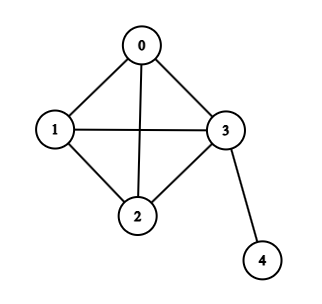

# cs412_np_project
Exact Solution commands and input
Command: python ./cs412_np_project/exact_solution/min_coloring_exact.py

First Line: Number of vertices
The remaining lines describe the graph:
    Each line corresponds to a vertex and lists the vertices it is connected to.
    The vertices are 0-indexed (i.e., the first vertex is 0).

Example Input:
5
1 2 3
0 2 3
0 1 3
0 1 2 4
3

First line (5): There are 5 vertices.
Second line (1 2 3): Vertex 0 is connected to vertices 1, 2, and 3.
Third line (0 2 3): Vertex 1 is connected to vertices 0, 2, and 3.
Fourth line (0 1 3): Vertex 2 is connected to vertices 0, 1, and 3.
Fifth line (0 1 2 4): Vertex 3 is connected to vertices 0, 1, 2, and 4.
Sixth line (3): Vertex 4 is connected to vertex 3.

The input would look something like: 
 

